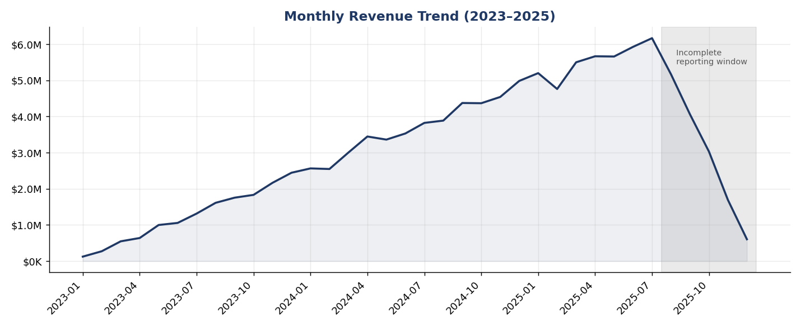
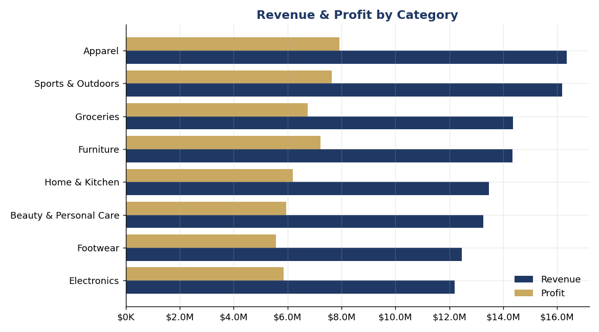
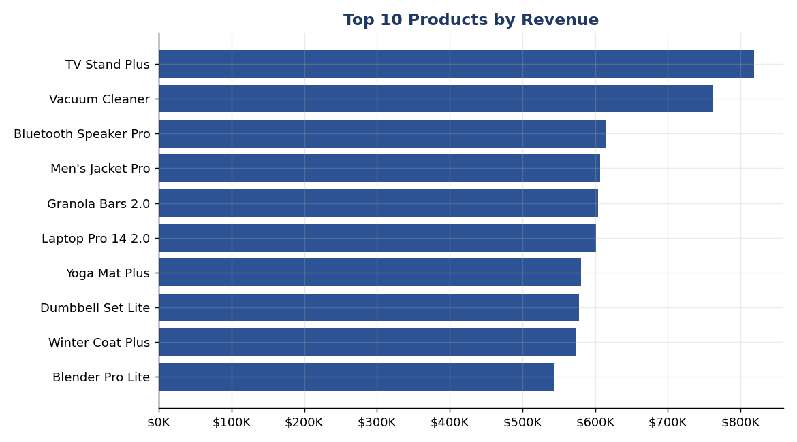
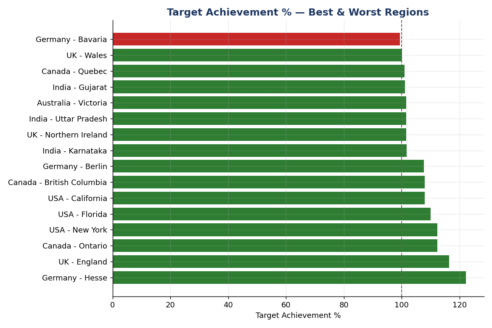
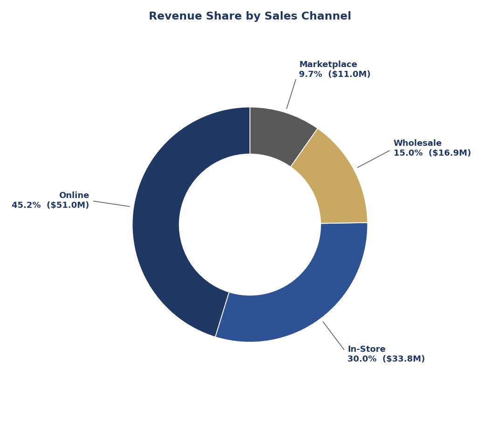
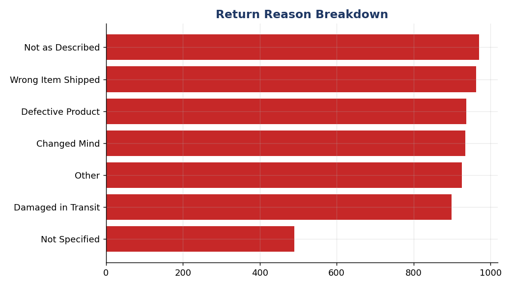

# Business Performance 360° Dashboard (CEO Dashboard)
### An end-to-end Data Analytics project — SQL · Excel · Python · Power BI


A full analytics pipeline for a fictional multinational retailer,
**GlobalMart Retail Inc.**, built the way a real Data Analyst would deliver
it: messy raw data → cleaned & validated data → a queryable database → a
statistical analysis layer → an executive dashboard, with every number
traceable back to source.

<p align="center">
  
  <br>
  <em>Monthly revenue trend from the Executive Overview analysis — 2023 through the complete reporting window, with the incomplete/in-progress final months clearly flagged rather than misread as a decline.</em>
</p>

---

## 📊 The Business Problem

GlobalMart's leadership had no single, real-time view of company performance
across 6 countries, 8 categories, and 4 sales channels — just fragmented
regional reports on different schedules. This project builds the fix: the
**Business Performance 360° Dashboard**, a unified source of truth for the
CEO and executive team.

## 🏆 Headline Results

| Metric | Value |
|---|---|
| Total Revenue | **$112.6M** |
| Total Profit | **$53.1M** (47.2% margin) |
| Total Orders | **101,800** |
| YoY Growth (like-for-like) | **+74.5%** |
| Return Rate | **6.0%** ($5.81M in refunds) |
| Regions Missing Target | **42.5%** of region-months |

*(See `Report/Business_Insights_and_Recommendations.md` for all 27 insights and 15 prioritized recommendations.)*

## 📸 Visual Highlights

A selection of the Python-generated executive charts (full set of 10 lives in `Images/python_charts/`).

<table>
<tr>
<td width="50%">

**Revenue & Profit Analysis**


</td>
<td width="50%">

**Product Performance**


</td>
</tr>
<tr>
<td width="50%">

**Regional Performance**


</td>
<td width="50%">

**Channel Analysis**


</td>
</tr>
</table>

**Customer / Return Analysis**
<p align="center">
  
</p>

## 🗂️ Project Structure

```
Business-Performance-360-Dashboard/
├── Dataset/
│   ├── raw/              Messy source data (100K+ orders, deliberate data-quality issues)
│   ├── cleaned/           Ground-truth cleaned data
│   └── powerbi_ready/     Star schema for Power BI (fact + dim tables)
├── SQL/                   Schema, cleaning script, 40 business queries
├── Python/                Generation, cleaning, EDA, charts, KPIs & insights
├── Excel/                 CEO_Dashboard_Workbook.xlsx (16 sheets, 430K+ live formulas)
├── PowerBI/               Build guide, DAX measures, HTML mockup, exec walkthrough
├── Images/                Generated charts
├── Report/                Full project report, data dictionary, insights
├── Resume/                ATS-friendly resume content
└── README.md
```

## 🛠️ What's in Each Layer

### SQL
- Full schema: 8 tables, PK/FK constraints, `CHECK` constraints, 10 indexes
- `ALTER` / `UPDATE` / `DELETE` cleaning pipeline (staging → production)
- **40 business queries** across revenue, product, regional, customer,
  channel, sales rep, and returns analysis — every query actually executed
  and validated against a live database, not just written

### Excel
- Data cleaning via live formulas (never hardcoded values)
- Lookup functions: `INDEX/MATCH`, `VLOOKUP`, direct-offset `INDEX`
- Pivot-style summary tables + charts, conditional formatting, KPI summary
- **430,262 formulas, zero calculation errors** (verified via automated recalculation)

### Python
- Pandas/NumPy cleaning pipeline mirroring the SQL logic
- Feature engineering: profit margin, delivery time, repeat-customer flags,
  target achievement
- 10 static Matplotlib charts + 8 interactive Plotly chart specs
- 15 KPIs and 27 data-driven business insights, computed — not hand-written

### Power BI
- Complete data model + 30 DAX measures (`PowerBI/DAX/measures.dax`)
- Page-by-page build guide for all 8 dashboard pages, including slicers,
  drill-through, bookmarks, tooltips, and mobile layout
- An interactive HTML mockup (`CEO_Dashboard_Mockup.html`) built on the real
  data, plus a written executive walkthrough script

## 🔍 A Note on Data Integrity

This project treats bugs and data-quality issues as things to catch and
document, not hide. A few examples surfaced during actual validation
(not just written and assumed correct):

- A product-generation bug that miscategorized all 500 products — caught,
  fixed, regenerated
- An Excel formula pattern that caused a genuine multi-minute computation
  hang — root-caused and replaced with an efficient pattern
- A misleading revenue trend caused by the synthetic data's date-sampling
  distribution — handled the way a real analyst treats an incomplete
  reporting period: annotated and excluded from trend KPIs, not hidden
- A duplicate-detection formula that silently excluded valid records —
  caught by checking the output count, not just the formula logic

See `Report/Project_Report.md` Section 4 for the full list.

## 🚀 Getting Started

1. **Explore the data**: `Dataset/raw/` (messy) and `Dataset/cleaned/` (validated)
2. **Run the SQL**: `SQL/01_create_tables.sql` → `02_data_load_and_cleaning.sql` → `03_business_queries.sql`
3. **Run the Python pipeline**: scripts in `Python/` are numbered in execution order
4. **Open the Excel workbook**: `Excel/CEO_Dashboard_Workbook.xlsx`
5. **View the dashboard mockup**: open `PowerBI/CEO_Dashboard_Mockup.html` in any browser
6. **Build it in Power BI**: follow `PowerBI/CEO_Dashboard_BuildGuide.md`

## 📄 Full Documentation

- [`Report/Project_Report.md`](Report/Project_Report.md) — complete write-up
- [`Report/01_Project_Foundation.md`](Report/01_Project_Foundation.md) — business scenario, data model, ERD
- [`Report/02_Data_Dictionary.md`](Report/02_Data_Dictionary.md) — column-level spec for every table
- [`Report/Business_Insights_and_Recommendations.md`](Report/Business_Insights_and_Recommendations.md) — 27 insights, 15 recommendations
- [`PowerBI/Executive_Walkthrough.md`](PowerBI/Executive_Walkthrough.md) — presentation script

## 🧰 Tech Stack

**SQL** (MySQL syntax) · **Python** (Pandas, NumPy, Matplotlib, Plotly) ·
**Excel** (formulas, pivot tables, conditional formatting) · **Power BI**
(DAX, data modeling) · **HTML/CSS/JS** (dashboard mockup, Chart.js)

---

*This is a portfolio project built with a synthetic dataset for GlobalMart
Retail Inc., a fictional company. Company name, data, and figures are not real.*
